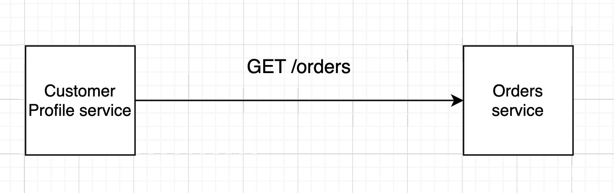

## Reliability patterns at Glovo

Welcome to the reliability patterns workshop! 

This readme will help you to set up your dev environment to implement
the reliability patterns we've just seen in the previous session.
The goal of this workshop is to implement a simple version of the following
reliability patterns: 

* Fallback
* Timeout
* Retry
* Circuit breaker

The scenario is simple. You need to implement a class that provides methods to 
reliability fetch orders from the orders service. The client could be the Customer Profile service,
which would need to fetch the list of orders for a customer in order to display
it as part of the customer profile. 



### Dev setup

First of all you need to download the workshop repo by running: 

```shell
git clone git@github.com:Glovo/reliability-patterns-workshop.git
```

The recommended way to follow this workshop is by using the [IntelliJ IDE](https://www.jetbrains.com/idea/).
You can download it from [this link](https://www.jetbrains.com/idea/download/). Make sure to download
the **community** edition to avoid issues with the paid version license. 

Once you have Intellij installed in your laptop you should be able to open the project by clicking on
Open. Then, you will need to find the directory where you cloned the repo and select the repository folder.

Wait some time until the project is loaded. Now you are ready to start implementing the reliability 
patterns!

If you have any problem let Javi or Pol know. 

### Implementation

To implement these patterns you will need to implement the methods from the 
[OrdersFetcher](./lib/src/main/java/stability/OrdersFetcher.java) interface using 
the [ReliableOrdersFetcher](./lib/src/main/java/stability/ReliableOrdersFetcher.java) class.
You just need to add the implementation of each reliability pattern in the corresponding
method. Use the `url` field to send the GET request to fetch the list of Orders.

Once you are ready to test your implementation you just need to run the tests in 
[ReliableOrdersClientTest](./lib/src/main/java/stability/ReliableOrdersClientTest.java).
When the tests are executed, a local HTTP server is started to simulate the `GET /orders`
endpoint from the Orders service.

#### Hints

In case that you need some help to start, you can take a look at [ExampleOrdersClient](./lib/src/main/java/stability/ExampleOrdersClient.java)
to see how to fetch and deserialize the list of orders from the orders service.

Some other Java types that can help you to implement the reliability patterns are listed below:

* [Future](https://docs.oracle.com/javase/8/docs/api/?java/util/concurrent/Future.html)
* [ExecutorService](https://www.baeldung.com/java-executor-service-tutorial)

### Next steps

Congratulations! Your tests pass which means that you have successfully implemented 
the reliability patterns. If you want to see how a real implementation for these patterns
looks like, you can try to replace your implementation with the [Resilience4J](https://resilience4j.readme.io/docs/getting-started)
library. 

[Here](https://resilience4j.readme.io/docs/gradle) you can find how to add the library to the project.
This is a library we are currently using at Glovo, so you could learn how a production ready
reliability implementation looks like.
